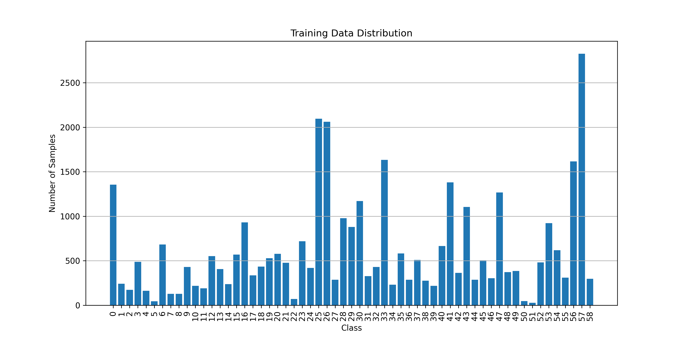

### 0.说明
由于平台限制，完整的项目放在百度网盘。

链接如下： https://pan.baidu.com/s/1FsdgSPV4LPrDKvB2CFQV9w?pwd=twbv 提取码: twbv 

### 1. 依赖

    Python3.8 PyTorch 版本 1.7.0+cu110
    其余参考 'requirements.txt'

### 2. 关于数据的处理

由于原数据集的第44类和第45类的样本很少，因此我们直接删除了44类和45类的数据。官方提供的数据集包含训练集、验证集和测试集。我们将训练集和验证集进行了合并组成的新的训练集放在了'data/train'，测试集放到了'data/test'。

Q：如何合并训练集和验证集
A：首先先下载训练集和验证集，然后放到把图像都放到 'data/temp/images' 下面，把每张图像的标签（jason文件）放到 '/data/temp/labels/'下面。然后运行 move.py 即可完成合并。

数据集链接：https://pan.baidu.com/s/1i723X1RZbWP4iQia5TnKMw?pwd=3yny 提取码: 3yny 

### 3. 模型选择

模型目前选用的预训练模型是 resnet50。

### 4. 超参数设置

详情的参数在 config.py 中

### 5.使用方法

- 训练模型：运行 main.py
- 直接使用训练好的模型进行测试：运行 test.py
- 对自己想要测试的图片，全部上传到'/detect'下面，然后运行 detect.py 即可进行批量预测。

### 6.项目结构说明

- charts ： 存放 Data_distribution_visualization.py 和 Visual_charts.py 用于生成训练数据分布图以及训练和验证的精确率和损失。
- checkpoints: 存放训练检查点和最终的最优模型。
- data : 包含训练集和测试集。
- dataset : 存放数据加载的 dataloader.py。
- detect : 用于存放用户需要批量预测的图片。
- logs : 用于存放训练日志。
- models : 存放获取预训练模型的函数。
- submit : 存放测试之后的json结果文件。
- trans : 存放将模型部署到APP的相关文件。
- config.py : 存放详细的参数设置。
- data_aug.py : 对数据进行增强。
- detect.py : 批量处理用户上传的图片。
- main.py : 训练模型。
- move.py : 将训练集和验证集合并为训练集。
- test.py : 用训练好的模型进行测试。
- utils.py : 存放一些工具函数，如 save_checkpoint, AverageMeter等。
